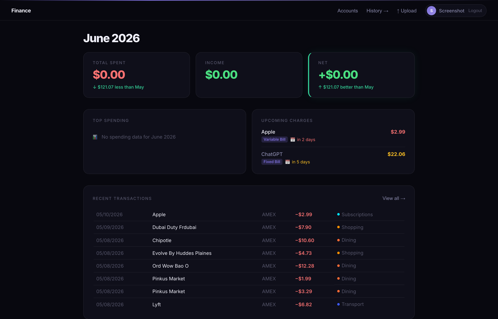
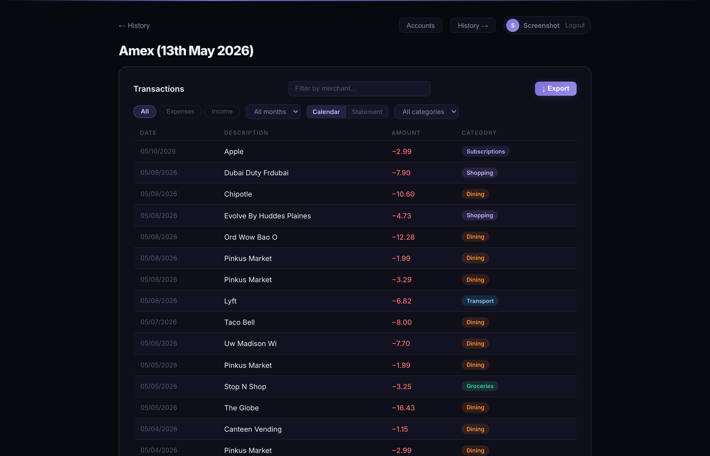
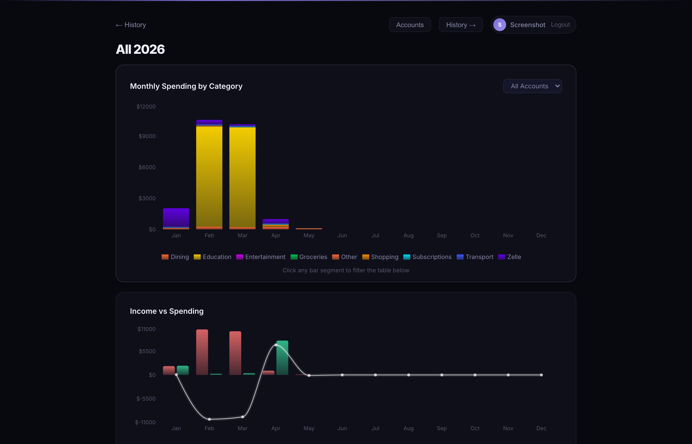

# Finance Categorizer

An AI-powered personal finance tool that automatically categorizes bank transactions, detects recurring subscriptions, and visualizes spending trends — running entirely on your local machine. No transaction data ever leaves your device.

## Features

- Automatic categorization via a 3-tier pipeline: cache → regex rules → local LLM (llama3.2 via Ollama)
- Supports CSV and PDF uploads from UWCU, AMEX, Chase, and Wells Fargo
- Recurring subscription and bill detection
- Monthly spending charts with category breakdown
- Credit card billing cycle support (configurable per card)
- Multi-account tracking with automatic double-counting prevention
- Category correction that learns from your edits over time
- Dashboard with month summary, upcoming charges, and recent transactions

## Tech Stack

- **Frontend:** React, Recharts, Framer Motion
- **Backend:** Python, FastAPI
- **AI:** llama3.2 via Ollama (runs locally)

## Setup

### Prerequisites

- Python 3.13+
- Node.js 18+
- [Ollama](https://ollama.com) with llama3.2 pulled

### Run locally

Backend:

```bash
python3 -m venv venv
source venv/bin/activate
pip install -r requirements.txt
python main.py
```

Frontend (separate terminal):

```bash
cd frontend
npm install
npm run dev
```

Visit `http://localhost:5173`

## Screenshots




